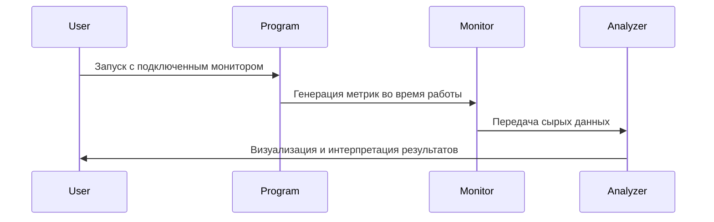

# Программные измерительные мониторы

## 1. Определение программного измерительного монитора

**Программный измерительный монитор** - это инструмент для сбора, анализа и визуализации метрик работы программного обеспечения в реальном времени или при постобработке.

**Примеры инструментов**:
- `Prometheus` - система мониторинга и оповещения с временными рядами
- `Grafana` - платформа для визуализации и анализа метрик
- `New Relic` - SaaS-решение для мониторинга производительности приложений

## 2. Ключевые характеристики ПО для мониторинга

Основные измеряемые характеристики:
1. **Производительность** (время отклика, throughput, latency)
2. **Надежность** (uptime, частота ошибок, MTBF)
3. **Использование ресурсов** (CPU, память, дисковый I/O, сетевой трафик)

## 3. Этапы работы с монитором

Типовая последовательность действий:

1. **Запуск программы** с интегрированным или внешним монитором
2. **Сбор данных**:
   - Инструментирование кода (probes)
   - Перехват системных вызовов
   - Анализ логов
3. **Интерпретация**:
   - Агрегация метрик
   - Построение временных графиков
   - Выявление аномалий и узких мест
